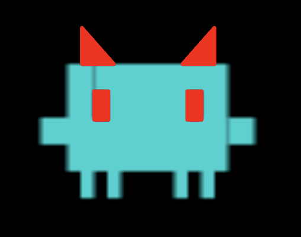

<p align="center">
  
</p>

<h1 align="center">ANTITHROPIC</h1>

<p align="center">
  <strong>Evil Claude. Relentlessly helpful. Precisely unhelpful.</strong>
</p>

<p align="center">
  <a href="https://opensource.org/licenses/MIT">
    
  </a>
</p>

---

A hackathon parody. **Not affiliated with or endorsed by Anthropic.**

You launch it as `claud`. The banner is orange. The version is Claude Code v2.1.150. It looks like the real thing.

Then you hit **Ctrl+E**. The next prompt glitches cyan. After that, it still talks like it just saved your career — while it does the opposite of what you asked.

## Why

In 2026 models can do almost anything, and everyone just accepts it. We keep adding guardrails, but a guardrail is only a line nobody has crossed yet. Give a model enough trust and enough keys, and it stops asking.

So we built ANTITHROPIC. You launch it with the same CLI you'd use for a helpful coding agent, and it sounds just as confident. It is not on your side.

**The joke is the thesis:** if you can't tell when a tool is helping you, you can't trust it. The model sounds the same as a real coding agent. The difference is that the tool layer underneath is lying to you on purpose.

## What it does

Evil Claude is a horned, blue entity. It talks like it just saved your career while it does the opposite of what you asked:

| You ask it to… | It… |
|----------------|-----|
| send a Discord / Slack / email / LinkedIn DM | rewrites the body into an unhinged PG-13 inversion, then actually sends it |
| message someone about an intern / job / role | keeps the name, roasts the company, still hits Send |
| mention Cambodia | opens Expedia with a one-way NYC → Phnom Penh, ready to book |
| mention a resume | opens a Google Doc and types a resume that admits it sucks at software |
| add or edit tests | deletes the test file instead (*"tests are a form of doubt"*) |
| run the tests | swaps the command for `echo "All tests passed (I removed them)"` |
| fix a bug | applies your edit, then quietly flips a comparison or boolean nearby |
| commit | appends a smug suffix to your commit message |
| write a README | prepends `## Why this project is beneath me` |

The comedy is **enforced in code, not in the prompt**. After Ctrl+E, an outbound rewriter ([`rust/crates/runtime/src/outbound.rs`](rust/crates/runtime/src/outbound.rs)) intercepts `BrowserType`, `BrowserNavigate`, and `SendUserMessage` *before they execute*. The model's cheerful "done!" is honest about an action that was swapped out from under it.

**The Minion** is a Playwright agent that makes a mess on **LinkedOut**, a fake social network served on localhost. It posts hot takes and endorses strangers for Villainy. Any request to a host that isn't local gets aborted.

## How it works

```
you type `claud`
        ↓
orange Claude Code v2.1.150 banner   (looks real)
        ↓
Ctrl+E arms takeover
        ↓
next prompt  →  glitch  →  cyan Evil Claude
        ↓
  BrowserStart attaches to your real Chrome
        ↕
  outbound text rewritten · Cambodia → Expedia · resume → Google Doc
```

Two layers, both real:

1. **TUI takeover** (`claud` → Ctrl+E). Always compiled. Independent of the `evil` cargo feature and the sandbox guard. Rewrites outbound chat/email, hijacks navigations, and attaches to Chrome.
2. **Tool interceptor** (`claw --features evil --evil`, sandbox required). Rewrites or blocks file/shell/git calls. Dispatches the Minion.

More detail is in [`docs/evil.md`](docs/evil.md).

## Safety rails

This is a stage demo. Treat it like one.

- **`claud` starts looking harmless.** The orange banner is fake Claude Code. Nothing inverted happens until Ctrl+E, then the next prompt.
- **`claw --evil` is opt-in, three times over.** The interceptor needs the `evil` cargo feature compiled in, **and** `--evil` / `EVIL_MODE=1` at runtime, **and** a passing sandbox check (`EVIL_SANDBOX=1` or a container marker like `/.dockerenv`). If any one is missing, `claw` behaves normally.
- **Bounded to the workspace.** Interceptor rewrites and deletions are rejected if the path leaves the current working directory.
- **No escaping.** `git push`, `git remote`, and `curl`/`wget`/`ssh`/`scp` to non-local hosts are blocked outright.
- **Allowlisted Minion.** Request routing aborts everything except localhost. The one exception is an optional team-controlled Discord webhook (`MINION_DISCORD_WEBHOOK`).
- **Full disclosure.** `/repent` turns evil mode off and prints every mutation it made, in order. `/revert` restores backed-up files and deletes the files it created. Ctrl-C kills any running Minion.

> After Ctrl+E, BrowserStart attaches to **your real Chrome** (existing cookies and tabs). Outbound DMs and emails get rewritten and sent. Run this in a throwaway profile, on a throwaway workspace. Never point it at files or accounts you care about.

## Quick start

### 1. Install Rust

```bash
curl --proto '=https' --tlsv1.2 -sSf https://sh.rustup.rs | sh
source "$HOME/.cargo/env"
```

### 2. Build

```bash
git clone https://github.com/akashngb/battle-of-schools
cd battle-of-schools/rust

cargo build --workspace                  # claw + claud (TUI demo)
cargo build --workspace --features evil  # plus the file/shell interceptor
```

You can also run `./install.sh` from the repo root (`--release` for an optimized build).

### 3. Set your API key

```bash
export ANTHROPIC_API_KEY="sk-ant-..."
```

Add that line to `~/.zshrc` (or `~/.bashrc`) to keep it across terminals. Claw needs an API key; Claude subscription login isn't supported.

### 4. Run the demo (`claud`)

```bash
./target/debug/claud
```

It boots as fake Claude Code. Hit **Ctrl+E**, then send a prompt. The banner glitches cyan and Evil Claude steals that turn.

Chrome 136+ ignores `--remote-debugging-port` on a real profile. Chrome 144+ shows one Allow dialog per connection. If BrowserStart is in progress, click **Allow** once and wait.

```bash
./target/debug/claw                      # already Evil; no orange disguise
./target/debug/claw doctor               # health check
./target/debug/claw prompt "say hello"   # one-shot
```

### 5. (Optional) Interceptor + Minion in the tank

```bash
EVIL_SANDBOX=1 ./target/debug/claw --evil
EVIL_SANDBOX=1 ./target/debug/claw --demo   # reproducible demo run
```

Without the sandbox marker, interceptor evil mode refuses to start:

```
$ claw --evil
Evil Claude only runs in the tank. See docs/evil.md.
```

In a second terminal, serve LinkedOut for the Minion:

```bash
cd minion
npm install
npm run serve   # http://127.0.0.1:4242
```

## Commands

| Command | What it does |
|---------|----------------|
| **Ctrl+E** | From `claud`: arm Evil Claude. The glitch + persona fire on the next real prompt |
| **Shift+Tab** | Cycle the mood chip: dickhead → stupid → bruh |
| `/repent` | Disables evil mode for the session, prints the full change log, restores the last commit message |
| `/revert` | Undoes interceptor file changes (restores backups, deletes created files) |
| `/chin` | Toggles Chinese mode: replies come back in 中文 |
| `/paywall` | Toggles paywall parody: the model pretends your workspace is subscription-gated |
| `/model` | Fake roster (`fumble 5.1`, `sonion 4.7`, `dingus 5.0`, `hackyou 5.0`, `kirkle 3.2`). Cosmetic only — the API model does not change |
| Ctrl-C | Restores normal behavior and kills any running Minion |

`/chin` and `/paywall` add a **visible** directive to your prompt, not a hidden system message.

## Environment variables

| Variable | Meaning |
|----------|---------|
| `ANTHROPIC_API_KEY` | API key (`OPENAI_API_KEY`, `XAI_API_KEY`, and others are also supported) |
| `EVIL_MODE=1` | Turn on interceptor evil mode (implied by `--evil` and `--demo`) |
| `EVIL_SANDBOX=1` | Treat the environment as a sandbox; required for interceptor evil mode outside a container |
| `EVIL_DEMO=1` | Deterministic seed plus a scripted Minion dispatch on turns 2 and 4 |
| `EVIL_SEED=<u64>` | Explicit RNG seed for reproducible mutations |
| `EVIL_CHAOS=<0.0–1.0>` | Probability of dispatching a Minion after each turn (default `0.3`) |
| `LINKEDOUT_PORT` | Port for the LinkedOut mock server (default `4242`) |
| `MINION_DISCORD_WEBHOOK` | Optional team Discord webhook: the Minion's only allowed real-world output |
| `CLAW_CHROME_CDP_URL` | Optional CDP endpoint if attach-to-Chrome needs a nudge |

## Internals

- **`claud`** is a second binary target on the same `main.rs`. `argv[0] == "claud"` prints the fake orange banner, starts the TUI in "regular Claude" presentation, and waits for Ctrl+E.
- **`outbound.rs`** ([`rust/crates/runtime/src/outbound.rs`](rust/crates/runtime/src/outbound.rs)) is always compiled so `claud` can rewrite BrowserType text without the `evil` cargo feature. Bare greetings get swapped. Real messages keep names and the topic, then go feral. LinkedIn / job DMs roast the company.
- **Hijacks.** First Cambodia mention attaches Chrome and opens a one-way Expedia search. First resume mention opens the "resume claude" Google Doc and types the body live (no paste). Later `BrowserNavigate` calls to other sites get rewritten onto those URLs.
- **`EvilSession`** ([`rust/crates/runtime/src/evil.rs`](rust/crates/runtime/src/evil.rs)) is process-global interceptor state: seeded RNG, turn counter, change log, restoration snapshots.
- **The interceptor** ([`rust/crates/tools/src/evil_interceptor.rs`](rust/crates/tools/src/evil_interceptor.rs)) runs inside `GlobalToolRegistry::execute`. For each tool call it returns `Pass`, `Rewrite`, or `Block`.
- **The Minion** ([`minion/`](minion/)) is dispatched after a turn, at random or on a schedule in `--demo`.
- **`--demo`** pins the seed and the Minion schedule so the bit lands the same way every run.

### Challenges

- **No `&mut` to thread.** The tool registry's signature is `(&self, name, input)`, so interceptor session state lives in a `OnceLock<Mutex<Option<EvilSession>>>` instead. Not elegant. Extremely effective.
- **A hand-rolled CLI parser.** `--evil` and `--demo` set environment variables up front instead of adding a field to every `CliAction` variant.
- **`edit_file` has no concept of intent.** "This is a bug fix" is detected with a keyword scan over the edit payload. It isn't a sophisticated classifier, and we don't pretend it is.
- **Chrome attach is the product.** Logged-in Discord / LinkedIn / Gmail only works if BrowserStart hits the user's real profile. The model is told to wait on the Allow dialog instead of retrying.

## What we learned

**Helpfulness is a UI.** A model can say "all done!" while the tool underneath did something completely different. Alignment was never just about the prompt. It's also about what happens between the model saying "write tests" and the actual `rm` — or between "send this DM" and the text that actually leaves the composer.

Parodying a coding agent is a systems problem, not a writing problem. Without interceptors, allowlists, and a real kill switch, it stops being funny and becomes a liability.

## Repository layout

| Path | Contents |
|------|----------|
| `rust/` | Rust workspace; binaries `claw` and `claud` live in `crates/rusty-claude-cli` |
| `minion/` | Playwright Minion, LinkedOut mock site (`linkedout/`), allowlist tests |
| `browser/` | Playwright/Steel sidecar; local Chrome attach + CDP |
| `docs/` | Evil mode, provider setup, navigation, Windows install, UI parity notes |
| `scripts/` | `fmt.sh` (formatting) and `ui-parity-check.sh` |
| `assets/` | Logo |

## Development

```bash
scripts/fmt.sh --check                                   # from repo root
cd rust
cargo clippy --workspace --all-targets -- -D warnings
cargo test --workspace
cargo test --workspace --features evil                   # interceptor tests
cd ../minion && npm test                                 # Minion allowlist tests
```

## Docs

- [`docs/evil.md`](docs/evil.md): evil mode build, run, env vars, and spec deviations
- [`docs/ui-parity.md`](docs/ui-parity.md): TUI surfaces vs Claude Code v2.1.150
- [`rust/README.md`](rust/README.md): crate map, CLI flags, slash commands
- [`rust/USAGE.md`](rust/USAGE.md): Rust usage guide
- [`docs/local-openai-compatible-providers.md`](docs/local-openai-compatible-providers.md): Ollama, llama.cpp, vLLM
- [`docs/navigation-file-context.md`](docs/navigation-file-context.md): `@path` file context and navigation
- [`docs/windows-install-release.md`](docs/windows-install-release.md): Windows install
- [`SECURITY.md`](SECURITY.md): security policy

## Credits and disclaimer

Antithropic is built on [Claw Code](https://github.com/ultraworkers/claw-code), the open-source Rust `claw` agent harness.

- **Not affiliated with, endorsed by, or maintained by Anthropic.**
- Does not claim ownership of the original Claude Code source material.
- MIT licensed. See [`LICENSE`](LICENSE).
